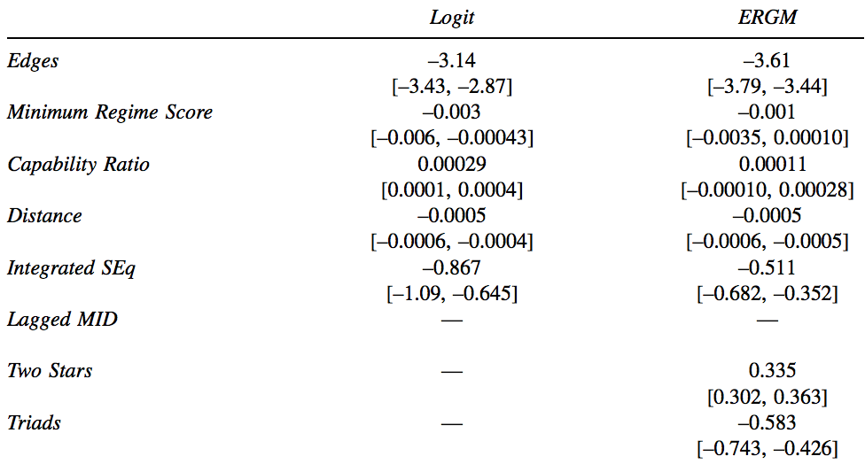
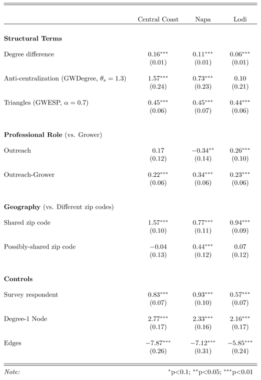
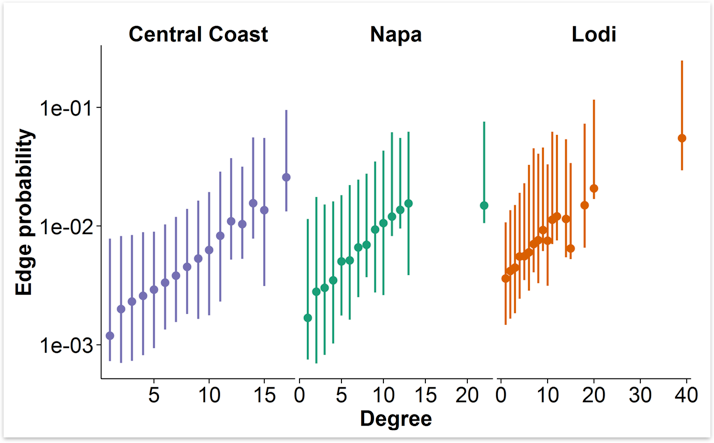

```{r setup, include=FALSE}
# Set some global options without displaying:
knitr::opts_chunk$set(cache = TRUE)
```

# Why ERGM?
## To predict ties
- As function of individual covariates
    - e.g. Are girls more popular than boys?

- As function of network structures
    - e.g. If Adam is friends with Bill, and Bill is friends with Carl, what can we say about the chances of Adam and Carl being friends?
        
## To handle non-independence of observations
Suppose we...

- Want to predict dichotomous ties  
    - e.g. two countries at war

- Predictors are actor attributes  
    - e.g. government types and difference in defense budgets  

- What's wrong with estimating a logistic regression from an *n* x *k* matrix like this?

regime 1 | regime 2 | budget diff | war?
:---:|:---:|:---:|:---:
dem | dem | $5e7 | 0
dem | theo | $1e9 | 0
dem | dict | $2e9 | 1

- Even if one is not explicitly interested in how other ties affect the likelihood of a tie, network effects imply a correlation of residuals, so omitting them will produce biased estimates.
    - e.g. If the U.S. and U.K. are both at war with Iraq, that fact must be considered for an unbiased estimate of the odds of the U.S. and U.K. being at war with each other.

Cranmer and Desmarais (2011) used ERGM to overturn conventional international relations wisdom:



## To disentangle and quantify exogenous and endogenous effects
- Simultaneously model effect of network structures, actor attributes, and relational attributes

- Get estimates and uncertainty for each effect

# What do we get from an ERGM?
- Much like a logit: Change in the (log-odds) likelihood of a tie for a unit change in a predictor

- Predictors are network-level statistics, but we think about their changes locally



# How does it work?
- (See Pierre-Andre's talk for details)

- Define joint-likelihood of all ties
    - Observed set is expectation

- Choose set of ($k$) sufficient statistics ($\Gamma$)

- Use MCMC to find parameter values ($\theta$) for statistics that maximize the likelihood of the set of observed ties ($Y_m$)
    - MCMC provides confidence intervals
  
- Maximize $\theta$:

$$
P(Y_m) = \dfrac{exp(-\sum_{j=1}^k\Gamma_{mj}\theta_j)}{\sum_{m=1}^Mexp(-\sum_{j=1}^k\Gamma_{mj}\theta_j)}
$$
  
- From parameter estimates, can estimate the probability of any edge:

$$
P(Y_{ij} | Y_{-ij}, \theta) = logistic \sum_{h=1}^{k}\theta_{h}\delta_{h}^{ij}(Y)
$$

That allows us to back out probabilities of interest, e.g.



# Let's get our hands dirty

## Preliminaries and non-ERGM `statnet` use.
```{r, include = FALSE}
library(statnet)
```

```{r}
# Load statnet suite of packages, includes network, sna, ergm, and more
library(statnet)

# Load an included dataset. 
# Vertices are monks in a monestary, edges are self-reported liking between the monks.
data('sampson')
n = samplike

# Get some info on the network
n

# Let's look at vertex attributes. Print them:
list.vertex.attributes(n)

# Print their values:
get.vertex.attribute(n, 'cloisterville')   # Whether they attended cloisterville before coming to the monestary
# Functions to view and change attributes of networks, vertices, and edges:
?attribute.methods

# Shortcut: n %v% 'group' is identical to get.vertex.attribute(n, 'group').
# Use %e% and %n% for edges and network, respectively.
n %v% 'group'  # How Sampson (the scholar who recorded the data) classified them into groups

# Create a random edge attribute
n %e% 'alpha' = sample(LETTERS[1:3], network.size(n), replace = TRUE)
n %e% 'alpha'

# And plot the network, with names on labels, vertex size scaled to in-degree, colored by group, shaped by whether they went to cloisterville
plot(n
     , displaylabels = TRUE
     , vertex.cex = degree(n, cmode = 'indegree') / 2
     , vertex.col = 'group'
     , vertex.sides = ifelse(n %v% 'cloisterville', 4, 50)
     )

?plot.network  # Many options for customizing plots
```

## Estimating and interpreting ERGMs

Estimate the simplest model, one with only a term for tie density (akin to an intercept term in a glm):
```{r}
m1 = ergm(n ~ edges)
summary(m1)
```
Because that is a dyadic-independent model (the likelihood of a tie doesn't depend on any other), ergm solves the logistic regression instead of resorting to MCMC. 

Note that the edges term represents exactly the density of the network (in log-odds). That is, the probability of any tie (aka the density of the network) is the inverse-logit of the coefficient on edges:
```{r}
network.density(n)
plogis(coef(m1))
```

Now let's make things more interesting and estimate a term for reciprocity of ties. That is, given an i -> j tie, what is the change in log-odds likelihood of a j -> i tie? The coefficient estimate on `mutual` tells us exactly that:
```{r}
m2 = ergm(n ~ edges + mutual)
summary(m2)
```
Whoa, something different happened there! MCMC happened. `ergm` went off and did a bunch of simulations to find approximate MLE coefficients. Let's interpret them. The baseline probability of a tie now is

```{r}
plogis(coef(m2)['edges'])
```

But if the reciprocal tie is present, then the log odds of the tie is 2.32x greater, which we can translate into probability using the logistic function:
```{r}
plogis(coef(m2)['edges'] + coef(m2)['mutual'])
```
Much more likely: 64% chance, compared to the baseline of 15%.

Before we start writing up our submission to Science though, we should check that the MCMC routine behaved well (that our estimates are likely good approximations of the MLEs) and that our model fits the data well. `statnet` has functions to do both those things.

## Checking MCMC chains
We use the `mcmc.diagnostics` function to get info on the MCMC chains, which by default are presented both graphically and through summary statistics:
```{r}
mcmc.diagnostics(m2)
```
We look for the same things as in any MCMC estimation: well-mixed, stationary chains. These look great -- the chains thoroughly explore the parameter space and don't wander over the course of the simulation. If your chains wander, you might A) have an ill-specified model, and/or B) be able to improve things by increasing the length of the MCMC routine or changing other parameters, which you can control via the `control` argument to `ergm`. Here's a (silly) example to show how to change the MCMC parameters and what bad chains look like:

```{r}
mbad = ergm(n ~ edges + mutual,
            control = control.ergm(MCMC.interval = 2))
mcmc.diagnostics(mbad)
```


## Examining model fit
Now that we can trust our model estimates, let's see if the model is a good fit to the data. We use the `gof` (goodness-of-fit) function for this purpose.

The current `gof` implementation has two useful modalities, one checks goodness-of-fit against the statistics included in the model (in aggregate); the other checks goodness-of-fit against some standard summary statistics (decomposed)

```{r}
m2_gof = gof(m2, GOF=~model)
m2_gof
plot(m2_gof)

m2_gof2 = gof(m2)
m2_gof2
par(mfrow = c(2, 2))
plot(m2_gof2)
```

Another way to examine fit is to simulate networks from the model parameters, which is easy using the S3 method for `simulate` for an ergm. This is useful for far more than checking model fit, note that you can change parameter values, constrain the network in many ways, etc. See `?simulate.ergm` for details.

## Simulating networks from ERGMs
Simulate four networks from our model and plot them, as we plotted the observed network above:
```{r}
sim_nets = simulate(m2, nsim = 4)

# Define a plotting function:
plot_nets = function(n)
    plot(n
     , displaylabels = FALSE
     , vertex.cex = degree(n, cmode = 'indegree') / 2
     , vertex.col = 'group'
     , vertex.sides = ifelse(n %v% 'cloisterville', 4, 50)
     )

par(mfrow = c(2, 2))
invisible(lapply(sim_nets, plot_nets))  # I wrap that in `invsible()` because `plot.network` returns the coordinates of nodes in the plot, which can be useful for reproducability or programmatic manipulation, but is distracting here.
```

Now it's clear we're not getting the monks into their groups. We can accomplish that by including a term for group homophily. 

For a complete list of ready to use statistics via `?ergm.terms`. If you don't see what you want, you can roll your own using the `ergm.userterms` package. To do so requires a bit of C, but really isn't too bad (assuming the statistic you want calculate is simple).
 
To add a term for homophily within Sampson's groups we use the term `nodematch`, which takes at least one argument (the nodal attribute), and provides the change in the likelihood of a  tie if the two nodes match on that attribute. 

Before we estimate the model, a handy trick: Remember that ERGM works by calculating network-level statistics. You can get the values of those statistics using the S3 method for `summary` for an ERGM:

```{r}
summary(n ~ edges + mutual + nodematch('group'))
```
So of the 88 ties in the network, 28 of them are reciprocal, and 63 of them are between monks within a group. So we should expect a strong positive coefficient for the group-homophily term. Let's see:

```{r}
m3 = ergm(n ~ edges + mutual + nodematch('group'))
summary(m3)
```

Indeed. The log-odds of a within-group tie are 2x greater than an across-group tie. We can exponentiate to find the change in the odds, `r exp(coef(m3)[3])`. That is true independent of the other attributes of the tie (e.g. whether or not it is reciprocal). The change in the probability of a tie is non-linear, it depends on the value of other statistics, so to calculate a change in probability you must choose a state for every other statistic in the model, then you can use the inverse-logit. E.g. Let's look at the probability of non-reciprocal ties within- and across-groups:
```{r}
plogis(coef(m3)[1])  # Just the "intercept" edges term
plogis(sum(coef(m3)[c(1, 3)]))  # Edges + group-homophily
```

Let's take a look at the goodness of fit of that model:
```{r}
par(mfrow = c(2, 2))
invisible(plot(gof(m3)))
```

We're not capturing the variance in in-degree though. 2-stars can be used to represent popularity:
```{r}
m4 = ergm(n ~ edges + mutual + nodematch('group') + istar(2))
summary(m4)
par(mfrow = c(2, 2))
# GOF plots:
invisible(plot(gof(m4)))

# Simulate networks from model and plot:
sim_nets = simulate(m4, nsim = 4)
invisible(lapply(sim_nets, plot_nets)) 
```

## Model comparison
Is the fit getting better? Looks like it, but hard to say, and there is danger of overfitting here as elsewhere. Can use formal model comparison as with other models:
```{r}
sapply(list(m1, m2, m3, m4), BIC)
```

## Model degeneracy and geometerically-weighted terms
Model degeneracy is a major problem for ERGMs. It can and often is a sign of an ill-specified model (as Pierre-Andre said, it's doing what you asked it to), but we often cannot estimate parameters for substantively justified terms. (I leave it to the reader to decide whether the preceeding statement is oxymoronic.) 

The quintessential such term is for triangles: How does the likelihood of a friendship change if two people already have a friend in common? For this small of a network we can estimate that directly:

```{r}
m5 = ergm(n ~ edges + mutual + nodematch('group') + istar(2) + triangles)
summary(m5)
```
In this case, having a shared friend makes a monk *less* likely to report liking another monk ($theta_{triangle} < 0$). That is very rare for positively-valenced-tie networks.

Note the implication here: The likelihood of tie changes proportionately to the number of shared friends two people have. That is, if having one shared friend makes a tie 25% more likely, having six shared friends makes a tie 150% more likely. Perhaps we should discount ties beyond the first one. We can do that with the geometrically-weighted edgewise shared partners (gwesp) term. It takes a parameter, $\alpha$ that controls how much to discount 2nd, 3rd, etc. shared partners `ergm` will estimate a value for $\alpha$ by default, but this is generally not a good idea; instead fixed it via the `fixed` argument to `gwesp`.

```{r}
m6 = ergm(n ~ edges + mutual + nodematch('group') + gwesp(alpha = .7, fixed = TRUE))
summary(m6)
```

Similarly, geometerically weighted degree (gwdegree) estimates the change in tie likelihood given the degree of the nodes involved, but with marginally decreasing weighting as degree increases. It takes a parameter related to gwesp's alpha, decay, which should also generally be fixed. For undirected networks, the term is `gwdegree`; for directed networks, in- and out-degree are modeled separately via `gwidegree`, and `gwodegree`, respectively. These terms can be useful for modeling a popularity effect, but more often they are used simply to aid model convergence. 

```{r}
m7 = ergm(n ~ edges + mutual + nodematch('group') + 
              gwesp(alpha = .7, fixed = TRUE) + gwidegree(decay = 1, fixed = TRUE))
summary(m7)
```

The way the `gwdegree` terms are constructed, negative estimates reflect an increased likelihood on ties to higher-degree nodes. Appropriate use and interpretation of the gw- terms is an active area of study, and I am working on a paper with more detailed guidance. For now, Hunter, 2007 in Social Networks is the canonical reference, and the [statnet listserve archieve](https://mailman13.u.washington.edu/mailman/private/statnet_help/) may also be helpful.
